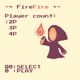
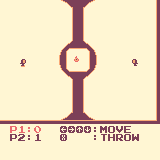
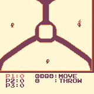
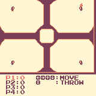
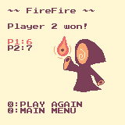

# FireFire

A game written in C for the [WASM-4](https://wasm4.org) fantasy console.

## Building

Make sure you have installed [WASM-4](https://wasm4.org/docs/getting-started/setup).
Build the resources and cart by running:

```shell
w4 png2src --c sprites/art.png -o src/art.h
w4 png2src --c sprites/bg2.png -o src/bg2.h
w4 png2src --c sprites/bg3.png -o src/bg3.h
w4 png2src --c sprites/bg4.png -o src/bg4.h
w4 png2src --c sprites/fireball.png -o src/fireball.h
w4 png2src --c sprites/mage.png -o src/mage.h
make
```

Then run it with:

```shell
w4 run build/cart.wasm
```

## Credits

This game was made using [WASM-4](https://wasm4.org) framework.

This game uses 4-color palette by [Kerrie Lake](https://lospec.com/palette-list/ice-cream-gb).

## Screenshots

Main menu:



2 player game:



3 player game:



4 player game:



Game over screen:


